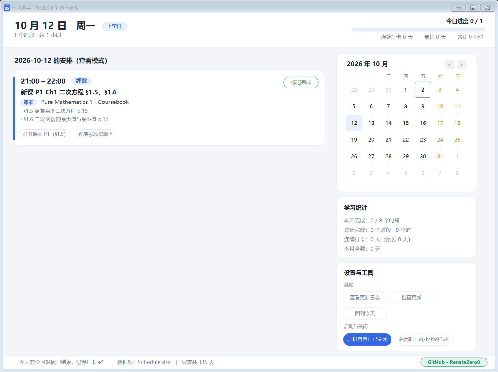

# 学习助手 StudyCompanion

一个跟着 `Schedule.xlsx` 走的 Windows 桌面小程序：**每天告诉你今天学什么、配套视频在哪、到点提醒你开始，并记录你有没有完成。**




---

## 直接使用

双击 **`StudyCompanion.exe`** 即可。首次运行已经帮你把**开机自动启动**设好了（注册表 `HKCU\...\CurrentVersion\Run`，启动参数 `--tray`），以后开机它会在右下角托盘静默待命。

如果不想开机启动：点界面右下角 **「开机自启：已开启」** 按钮切换，或右键托盘图标取消勾选。

| 操作 | 说明 |
|---|---|
| 关闭窗口 | 默认**最小化到右下角托盘**（不会退出）；想改成「点 X 直接退出」，用「设置与工具 → 关闭时」开关 |
| 双击托盘图标 | 重新打开主界面 |
| 右键托盘图标 | 打开主界面 / 重新读取课表 / 开机自启开关 / 退出 |

---

## 界面说明

```
┌──────────────────────────────────────────────────────────────┐
│  10 月 12 日  周一  [上学日]          今日进度 ▓▓▓▓░  1/2    │  ← 顶部：日期、徽章、进度、打卡统计
│  1 个时段 · 共 1 小时                                         │
├───────────────────────────────────┬──────────────────────────┤
│  今天要学的内容                    │  2026 年 10 月           │  ← 内置日历，可点任意一天回看
│  ┌──────────────────────────────┐ │  ┌────────────────────┐  │
│  │ 21:00–22:00  纯数  [标记完成] │ │  │ 一 二 三 四 五 六 日 │  │
│  │ 新课 P1 Ch1 二次方程 §1.5、§1.6│ │  │  绿色 = 全部完成    │  │
│  │ [课本] Pure Mathematics 1 - Coursebook                        │
│  │ · §1.5 更复杂的二次方程 p.15  │ │  │  小圆点 = 完成了一部分│ │
│  │ · §1.6 二次函数最值 p.17      │ │  └────────────────────┘  │
│  │ [打开课本 P1 §1.5][配套视频资源 ▾]│ │  学习统计 / 设置与工具  │
│  └──────────────────────────────┘ │                          │
└───────────────────────────────────┴──────────────────────────┘
```

### 1. 今天学什么（自动从 Schedule.xlsx 读取）

左上角是**当天日历单元格里的完整内容**：时间段、科目、要读的小节和页码、练习题范围。日期一换，内容自动跟着换。

**不查日历也能知道**：程序读的就是你那份 `Schedule.xlsx`，改了表格点一下「重新读取课表」即可。

### 2. 配套教学资源（下拉框）

每张卡片只放 **1–2 个按钮**，不再铺一排标签：

| 按钮 | 作用 |
|---|---|
| **打开课本 P1（§1.5）** | 直接打开对应课本 PDF **并跳到该小节所在的 PDF 页**（需要阅读器支持 `#page=` 锚点，Edge / Chrome / SumatraPDF 可用；WPS 阅读器可能只打开文件不跳页） |
| **配套视频资源 ▾** | 点开下拉菜单，里面按当天小节列好全部链接 |

下拉菜单里的条目：

- **精确资源**：如「The Maths Prof · 二次方程 (CIE P1)」「CIE 9709 章节索引」「A Level Physics Online」「MIT 8.01 经典力学」……
- **▶ YouTube 搜索**：用针对该小节的英文关键词直达搜索结果
- **▶ Bilibili 搜索（免翻墙）**：中文关键词，国内直接可用
- 点任意一条 → 用默认浏览器打开，菜单自动关闭；按 `Esc` 或点别处也能关

> 课本路径记录在 `data\books.tsv`。如果哪天移动了 PDF，程序会在 `Textbook\`、`D:\BaiduNetdiskDownload` 等目录里按文件名自动重新找一遍。

### 3. 到点提醒

到了当天任何一个学习时段的**开始时间**，右下角会滑出一个提醒浮窗，同时托盘弹出气泡 + 提示音：

- 「该学习啦！　21:00–22:00」→ 点「开始学习」直接打开主界面
- 时段**结束前 5 分钟**还会有一次「还有 5 分钟」提醒（已完成的不再提醒）
- 开机时如果正处在某个时段中间，会提示「正在进行 + 剩余多少分钟」

### 4. 完成打卡（记忆功能）

点卡片右上角的 **「标记完成」**：

- 卡片变绿、按钮变成「已完成 ✓」、顶部进度条前进、日历当天变绿
- 记录写在 `data\progress.tsv`，**关掉程序、重启电脑都不会丢**
- 全勤的那天在日历上是**实心绿色**，完成一部分显示小圆点

### 5. 内置日历 & 统计

- 日历可以翻月、点任意一天查看那天的安排（历史回看 / 未来预习）
- **学习统计**：本周完成 x/y 个时段、累计时段数与小时数、连续打卡天数（最长记录）、本月全勤天数
- **导出学习记录 CSV**：把整年每一天每个时段做成表格，方便复盘

---

## 命令行参数（一般用不到）

| 参数 | 作用 |
|---|---|
| `--tray` | 静默启动到托盘（开机自启用的就是这个） |
| `--selftest` | 自检：把课表解析结果、链接、课本跳转写进 `selftest.txt` |
| `--shot <路径> [--date yyyy-MM-dd]` | 离屏渲染界面截图（不显示窗口，用于检查排版） |
| `--testtoast` | 预览一次提醒浮窗 |

---

## 文件结构

```
StudyCompanion\
├─ StudyCompanion.exe      主程序（.NET Framework 4.x，Windows 自带，无需安装任何东西）
├─ README.md               本文件
├─ CHANGELOG.md            完整版本更新日志（程序内可查看）
├─ build.ps1               重新编译（会从 assets\app.ico 取图标）
├─ settings.ini            用户设置（关闭按钮行为等）
├─ assets\                 资源文件
│   ├─ app.ico             程序图标（多尺寸，编译时内嵌进 exe）
│   ├─ icon-preview.png    图标各尺寸预览（由 make_icon.py 生成）
│   └─ screenshot*.png     界面截图（README 里引用）
├─ src\                    源码（C#）
│   ├─ Program.cs          入口、单实例、命令行、自检
│   ├─ Schedule.cs         直接解析 Schedule.xlsx（zip + XML，不需要装 Excel）
│   ├─ Links.cs            小节 → 视频资源 / PDF 页码 / 课本名 的映射
│   ├─ Store.cs            完成记录持久化、统计、CSV 导入导出、开机自启
│   ├─ Ui.cs               配色与基础控件（卡片、胶囊按钮、迷你日历、重绘冻结）
│   ├─ MainForm.cs         主界面（顶部栏、任务卡片、右侧日历与统计）
│   ├─ ResourceMenu.cs     「配套视频资源」下拉菜单
│   ├─ MarkdownView.cs     自绘 Markdown 阅读控件
│   ├─ DocViewer.cs        更新日志窗口
│   └─ Toast.cs            提醒浮窗 + 托盘
├─ data\                   运行时数据
│   ├─ books.tsv           课本 PDF 路径与页码偏移
│   ├─ pages.tsv           小节号 → PDF 物理页（用 tools 里的脚本生成）
│   ├─ daycache.tsv        课表缓存（WPS 占用 xlsx 时的兜底）
│   └─ progress.tsv        你的完成记录 ← 这份文件最珍贵，别删
└─ tools\
    ├─ make_icon.py        生成 assets\app.ico（多尺寸程序图标）
    ├─ build_page_index.py 扫描课本 PDF 重建 pages.tsv
    └─ fix_pm23_pages.py   修正 PM2&3 的印刷页码
```

## 重新编译

```powershell
powershell -ExecutionPolicy Bypass -File build.ps1
```

只要 Windows 自带的 `csc.exe`，不需要 Visual Studio。

## 已知限制

- **课表被 WPS 独占打开时读不到**：程序会自动改用 `data\daycache.tsv` 缓存。刷新课表用**托盘右键菜单 →「重新读取课表」**（界面上的按钮在 v1.6 已移除）。
- **PDF 页码跳转**依赖阅读器支持 `#page=`。WPS 阅读器可能忽略锚点，只打开文件；换 Edge / Chrome / SumatraPDF 就能精确跳页。
- **提醒**依赖程序在运行。若托盘图标被退出，提醒就不会触发（重开即可）。
- 计划范围是 2026-10-01 ~ 2027-08-31；超出范围会提示「这一天没有安排」。

## 更新记录

> 完整历史见 **`CHANGELOG.md`**（程序里点「设置与工具 → 查看更新日志」可直接查看）。

**v1.9 — 资源文件收进 `assets\` 文件夹**

`app.ico` 和 4 张界面截图从顶层移到 **`assets\`**，顶层现在只剩 exe、3 个文档、1 个脚本、1 个配置和 4 个文件夹。同步更新了 `build.ps1` 的图标路径、`make_icon.py` 的输出位置、README 里的图片引用。

顺带把 `build.ps1` 改成**纯 ASCII（英文提示）**——之前它靠 UTF-8 BOM 才能让 PowerShell 5.1 正确读中文，但只要编辑一次就会掉 BOM、脚本立刻语法报错。

**v1.8 — 换掉 exe 图标；关闭提示窗改成 3 秒倒计时**

- 「关闭到托盘」的提示窗：**删掉「开始学习」按钮**、**3 秒自动消失**，唯一的「知道了」按钮显示倒计时 `知道了（3）→（2）→（1）`
- 程序图标换成**多尺寸 .ico**（蓝色渐变圆角方 + 白色日历页 + 对勾），包含 16～256 共 10 档，小尺寸单独渲染所以不糊
- 编译时加 `/win32icon`，**资源管理器里能看到 exe 图标**；再加 `/resource` 让程序按需取尺寸（托盘 16px、标题栏 32px）
- 图标由 `tools\make_icon.py` 生成，不依赖任何外部素材
- 修复 `build.ps1` 缺 BOM 导致 PowerShell 5.1 解析中文报错的问题

> 若资源管理器仍显示旧图标，那是 Windows 图标缓存，按 `F5` 刷新或运行 `ie4uinit.exe -show`。

**v1.7 — 修复「点 X 后任务栏图标消失、窗口还留在屏幕上」**

原因是关闭逻辑踩了两个 WinForms 的坑：

- 在 `FormClosing` 里直接 `Hide()`：设了 `e.Cancel = true` 之后关闭流程还会走完，会把窗口重新显示出来。现在改成 `BeginInvoke` 推迟到关闭流程结束之后再隐藏。
- `ShowInTaskbar` 的赋值会**重建窗口句柄**，必须**先设它、后 `Hide()`**，否则新建的窗口可能带着可见状态。

**顺带新增「关闭按钮行为」可选**（设置与工具 → 启动与关闭）：

| 选项 | 行为 |
|---|---|
| **关闭时：最小化到托盘**（默认） | 点 X 隐藏到右下角托盘，继续到点提醒 |
| **关闭时：直接退出** | 点 X 真正结束程序（停定时器、移除托盘图标、退出进程） |

同时修好了托盘退出逻辑：主窗口真被关闭时会结束整个程序；`Quit()` 加了防重入标志。

自检：`StudyCompanion.exe --closetest` 会分别验证两条关闭路径的最终状态。

**v1.6 — 下拉框留白、工具栏重做、更新日志阅读器**

**① 下拉框不再紧凑**

每行高度 34 → 38、标题栏 30 → 42；文字左边距加大，右侧箭头从贴着边框改为留出 18px；标题与分隔线、最后一行与下边框都加了留白；宽度按最长条目自动计算（最小 285）。

**② 「设置与工具」栏重做**

| 分组 | 按钮 |
|---|---|
| 学习记录 | 导出记录 CSV　／　**导入记录 CSV**（新增） |
| 其他 | **查看更新日志**（新增）　／　回到今天 |
| 启动 | 开机自启：已开启／已关闭 |

- **删除**：重新读取课表、打开课本目录、打开 Schedule.xlsx
- 改为**分组显示**，每组带小标题，不再是一堆平铺按钮

> 「重新读取课表」只是从界面移除了，**托盘右键菜单里仍然保留**，功能没丢。

**③ 新增「导入记录 CSV」**

把之前导出的学习记录读回来恢复打卡：按「日期 + 时段」匹配，**只导入标记为「已完成」的行**；已存在的自动跳过，重复导入不会出问题；结束会提示「新增 / 已存在 / 无法识别」各多少条。自己手写的 CSV（前 3 列是 日期、星期、时段）也能导入。

往返测试：原始 2 条 → 清空 → 导入后 2 条（✔ 一致）→ 重复导入 0 新增（✔ 幂等）。

**④ 新增「查看更新日志」**

程序内置一个 Markdown 阅读器（自绘控件 `MarkdownView`），支持标题分级、项目符号、引用、分隔线、代码块，**不依赖系统对 `.md` 的文件关联**，不会弹「选择打开方式」。

**v1.5 — 假期/周末时段挪到下午 + 资源标签改成下拉框**

**① 时段调整**（已重新生成 `Schedule.xlsx`，程序自动跟着变）

| 日型 | 原来 | 现在 |
|---|---|---|
| 假期 / 寒暑假工作日 | 09:30–10:30　10:45–11:45 | **14:00–15:00　15:15–16:15** |
| 周末（周六 / 周日） | 09:30–10:30　20:00–21:00 | **14:00–15:00**　20:00–21:00 |
| 上学日 | 21:00–22:00 | 21:00–22:00（不变） |

保持"先新课、后练习"的顺序不变（下午第一段新课，第二段练习）。想只学 1.5 小时就连做 **14:00–15:30**。

**② 资源标签改成下拉框**

原来一张卡片最多铺 6 个标签（EAP 卡就是 6 个），很花。现在最多 2 个：

- `打开课本 P1（§1.5）` —— 常用动作留一个直达按钮
- `配套视频资源 ▾` —— 点开下拉菜单，里面才是全部链接

下拉菜单是自绘的无边框弹窗（不是系统 ComboBox），和整体扁平风格一致：有标题栏、悬停高亮、右侧 `›` 提示，**空间不够会自动向上翻**，点任意一项打开浏览器后自动关闭，按 `Esc` 或点别处也能关。

**v1.4 — 修复标签与文字的垂直对齐**

「课本」徽章和书名文字、以及时间文字和科目徽章，原来是各自用不同的定位方式画的（一个用矩形居中、一个用 `DrawString` 左上角定位加手调偏移），两者行高基准不同，视觉上差 2–5px。

改法：

1. 新增 `Ui.TextVC()` —— **左对齐 + 垂直居中 + 超长省略号**，和徽章共用一个行矩形，基准完全一致。
2. 徽章与文字统一按「行高中线」对齐：徽章高度 `17`，在行高 `20` 内居中；文字用同一个行矩形居中绘制。
3. 科目徽章原本画在 `y+2`，比时间文字低 2px，改为 `y`。

用像素级测量验证（截图分析墨迹包围盒的垂直中心）：

| 对比 | 修复前 | 修复后 |
|---|---|---|
| 时间文字 ↔ 科目徽章 | 2.00 逻辑px | **0.00 逻辑px** ✅ |
| 「课本」徽章 ↔ 书名文字 | 5.00 逻辑px | **0.33 逻辑px** ✅ |

**v1.3 — 日程卡片里加入「所需课本」标题**

每张任务卡片在标题下方多了一行带 `课本` 标签的课本名，格式与教材封面一致：

```
21:00 – 22:00   纯数                          [标记完成]
新课 P1 Ch1 二次方程 §1.5、§1.6
[课本] Pure Mathematics 1 - Coursebook
· §1.5 更复杂的二次方程 p.15
· §1.6 二次函数的最大值与最小值 p.17
[The Maths Prof · 二次方程] [CIE 9709 章节索引] [▶YouTube 搜索] [▶Bilibili 搜索]
[打开课本 P1（§1.5）]
```

识别规则（`VideoLinks.BookCodeFor`）：

| 卡片内容 | 识别为 | 显示课本名 |
|---|---|---|
| `P1 Ch1 …` | P1 | Pure Mathematics 1 - Coursebook |
| `P2/3 Ch7 …` | P2/3 | Pure Mathematics 2 & 3 - Coursebook |
| `M1 Ch4 …` | M1 | Mechanics - Coursebook |
| `S1 Ch8 …` | S1 | Probability & Statistics 1 - Coursebook |
| `FM Ch16 …` | FM | Further Mathematics - Coursebook |
| `Phy Ch12 …` / `Phy P1 …` | Phy | Physics - Coursebook |
| `真题精练 9709 P1/P3/M1/S1 …` | 按试卷号 | 对应课本 |
| `真题精练 9702 AS …` | Phy | Physics - Coursebook |
| `真题精练 9231 …` | FM | Further Mathematics - Coursebook |
| **复习 / 测试** | — | **不显示**（横跨多科，标一本会误导） |
| EAP | — | 不显示（无课本） |

卡片高度会随这一行自动增减，`--layouttest` 复测仍然全绿。

**v1.2 — 修复顶部「今日进度」文字与进度条重叠**

原来进度文字画在 `y-2`、进度条画在 `y+8`，文字行高约 20px，直接压在进度条上。现在顶部右侧改成结构清晰的三行，互不重叠：

```
                                        今日进度 0 / 2
        ▓▓▓▓▓▓▓▓░░░░░░░░░░░░░░░░░░░░░░
     连续打卡 0 天 · 最长 0 天 · 累计 0 小时
```

- 第 1 行：进度文字（10pt 加粗，右对齐；全部完成时显示「完成 ✓」并转绿）
- 第 2 行：进度条（高 9，右对齐同宽 320）
- 第 3 行：打卡统计（9pt，右对齐）
- 顶部栏高度由 78 调整为 84，给三行留出余量

**v1.1 — 修复「点击日历导致界面抖动」**

抖动是布局死循环造成的，三个根因都已修掉：

1. **列宽依赖滚动条**。原来列宽按 `ClientSize.Width` 计算，而竖向滚动条出现/消失会改变它 → 宽度变 → 卡片文字换行数变 → 卡片高度变 → 滚动条又切换 → 面板 `Resize` 再次触发布局，来回振荡。
   现在列宽一律按 **「面板宽度 − 预留滚动条宽度」**（`_sbW`）计算，与滚动条状态无关，布局一次收敛。
2. **没有重入保护**。`Resize` 在布局过程中被再次触发会递归刷新。现在加了 `_busy` 重入锁；内部布局改走不设锁的 `DoLayoutLeft / DoLayoutRight`，外部事件入口 `LayoutLeft / LayoutRight` 才设锁。
3. **重建控件导致闪动**。原来切换日期会销毁并重建整列卡片，点「标记完成」也会整列重建。现在：
   - 重建前用 `WM_SETREDRAW` 冻结重绘，完成后再一次性刷新；
   - 点击**同一天**不再触发任何刷新；
   - 打卡只做轻量刷新（`RefreshLight`），不重建控件；
   - 修掉了「遍历 `Controls` 的同时 `Dispose`」的隐患。

另外顺手修掉了日历控件同时用 `Dock = Top` 又手动 `SetBounds` 造成的定位冲突，以及每次布局都重复挂载 `Paint` 事件的无用操作。

**验证方式**：`StudyCompanion.exe --layouttest` 会离屏创建窗口，连续刷新 8 次并切换 6 个日期，把「日历卡 / 学习统计卡 / 设置与工具卡」的几何位置写入 `layouttest.txt`。当前结果：

```
[2] 连续刷新 8 次，布局发生变化次数 = 0  (期望 0)
[4] 右侧三张卡位置在切换日期时始终保持一致 = True  (期望 True)
[5] 回到今天后布局：与初始完全一致 ✓
```

